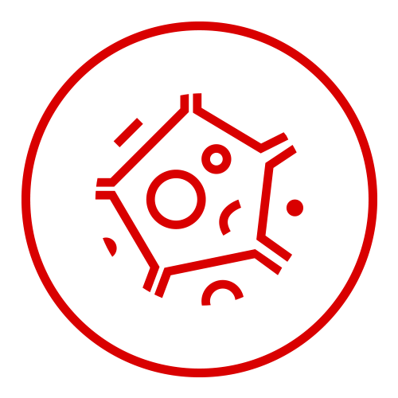

<div align="center">
  <a href="https://github.com/Pama-Lee/Nucleus">
    
  </a>
</div>
<h3 align="center">Nucleus</h3>
  <p align="center">
    一个插件化Java框架
    <br />
  </p>
<details>
  <summary>目录</summary>
  <ol>
    <li>
      <a href="#about-the-project">关于这个项目</a>
    </li>
    <li>
      <a href="#getting-started">开始工作</a>
      <ul>
        <li><a href="#prerequisites">依赖</a></li>
        <li><a href="#installation">创建一个Plugin</a></li>
      </ul>
    </li>
    <li><a href="#roadmap">计划实现</a></li>
    <li><a href="#contributing">贡献</a></li>
    <li><a href="#license">开源协议</a></li>
    <li><a href="#contact">联系我们</a></li>
    <li><a href="#acknowledgments">鸣谢</a></li>
  </ol>
</details>

## 关于这个项目

这是一个基于SpringBoot构建的上层框架, 致力于实现SpringBoot服务实例化剥离并实现其热拔插. 节约开发成本及部署难度及成本. 此项目可能不适用于企业环境,  但为中小微型Web服务提供助力.

为什么使用:
* 主服务一次启动, 插件热拔插.
* 提供诸多接口, 并实现服务生命周期控制, 便于注入Spring各流程中
* 便于使用, 开发便捷, 提倡编程式开发  :smile:

<p align="right">(<a href="#readme-top">back to top</a>)</p>

## 开始使用

插件开发流程

### 依赖

* maven
  ```    
  <dependency>
        <groupId>cn.dev-space</groupId>
        <artifactId>Nucleus</artifactId>
        <version></version>
    </dependency>
  ```

### 创建一个Plugin

1. 在项目根目录创建 **nucleus.yml**配置文件

```yaml
#### nucleus.yml 示例
Name: 插件名(必须)
Author: 作者(必须)
Version: 版本(必须)
Main: com.example.Main(启动类, 必须)
Description: 描述 (可选)
Route: 路由地址 (可选)
Language: 首选语言 (可选, 不填则为主框架所选语言)
```

<p align="right">(<a href="#readme-top">back to top</a>)</p>

2. 启动类继承 `cn.devspace.nucleus.plugin.PluginBase`类

```java
import cn.devspace.nucleus.Plugin.PluginBase;
public class Main extends PluginBase {
}
```


## 计划实现

- [x] 添加更新日志
- [x] 完善内部Login App
- [ ] 多语言支持
    - [x] Chinese
    - [ ] Enlish
    - [ ] French

<p align="right">(<a href="#readme-top">back to top</a>)</p>


## 如何贡献

如果您有一个可以使情况变得更好的建议，请分配存储库并创建拉动请求。
别忘了给项目一个star！ 再次感谢！

1. Fork这个项目
2. 创建你自己的开发分支 (`git checkout -b feature/AmazingFeature`)
3. 提交 (`git commit -m 'Add some AmazingFeature'`)
4. 推送到你的分支 (`git push origin feature/AmazingFeature`)
5. 打开合并请求

<p align="right">(<a href="#readme-top">back to top</a>)</p>


## License

Distributed under the MIT License. See `LICENSE.txt` for more information.

<p align="right">(<a href="#readme-top">back to top</a>)</p>


## 联系我们

Pama Lee -- pama@pamalee.cn

<p align="right">(<a href="#readme-top">back to top</a>)</p>
## 鸣谢
* Maven
* SpringBoot
* Java
* Hibernate
* Mybatis-Plus
* Nukkit
<p align="right">(<a href="#readme-top">back to top</a>)</p>